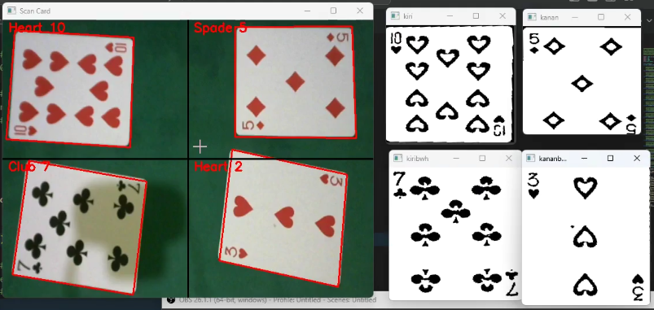
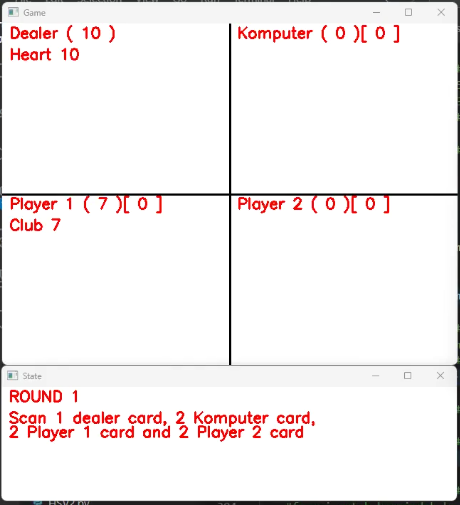

# PCV — Playing Card Detection & Classification

Final Project for the *Pengolahan Citra dan Video* (Image and Video Processing) course.

## Overview

This project implements a simplified card-based game with automated card detection and classification. Cards are captured on a green background, detected using contour-based image processing, and classified using a CNN model provided by the course. The system includes a functional Blackjack game with predefined dealer and computer logic.

## Features

* **Contour-Based Card Detection**
  Detects card regions using OpenCV contour extraction on green-screen input.

* **CNN-Based Card Classification**
  Custom card dataset trained with the provided CNN module.

* **Blackjack Game**
  Supports two human players, one computer player, and one dealer.
  Dealer and computer follow automated decision logic.

## Technology

* **Language:** Python
* **Key Library:** OpenCV (`cv2`)
* **Model:** CNN module provided by the course
* **Additional:** Standard Python modules

## Screenshots

### Card Scanning Interface



### Game UI



## Repository Structure

```
PCV/
├── cardRec.py          # Card detection & classification
├── TugasDemo.py        # Demo program
├── docs/               # Screenshots
│   ├── Interface_scan.png
│   ├── UI_game.png
│   └── output.png
```

## Usage

Run the demo:

```bash
python TugasDemo.py
```

## How It Works

1. Cards are placed on a green background.
2. The system detects card contours using OpenCV.
3. Detected cards are classified by the trained CNN model.
4. The Blackjack engine updates game flow using the predicted card values.
